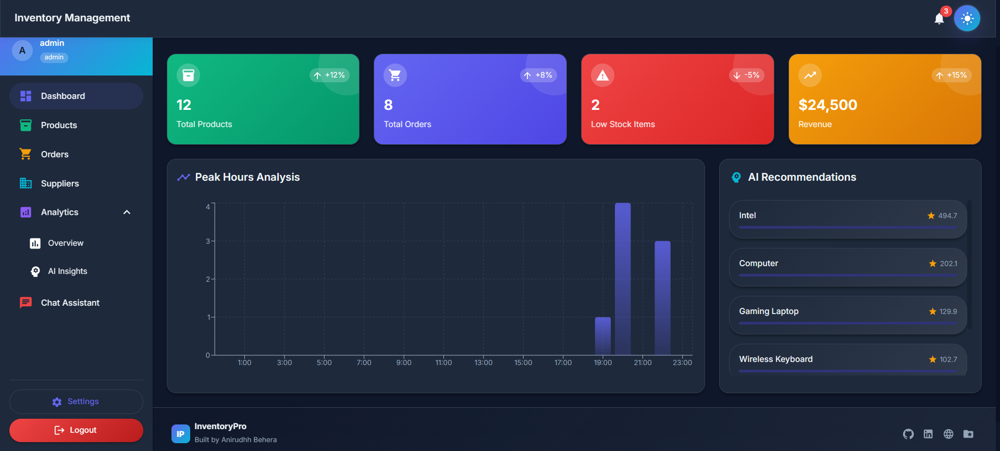
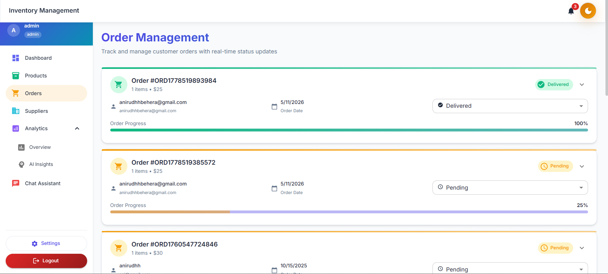
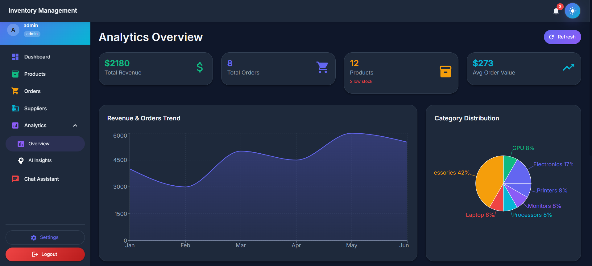
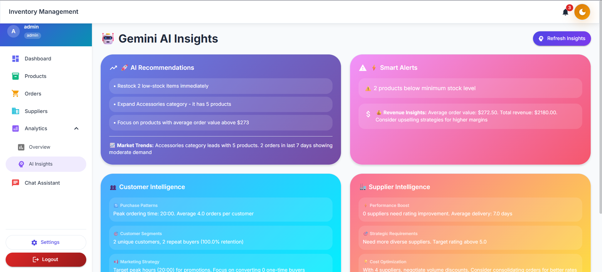
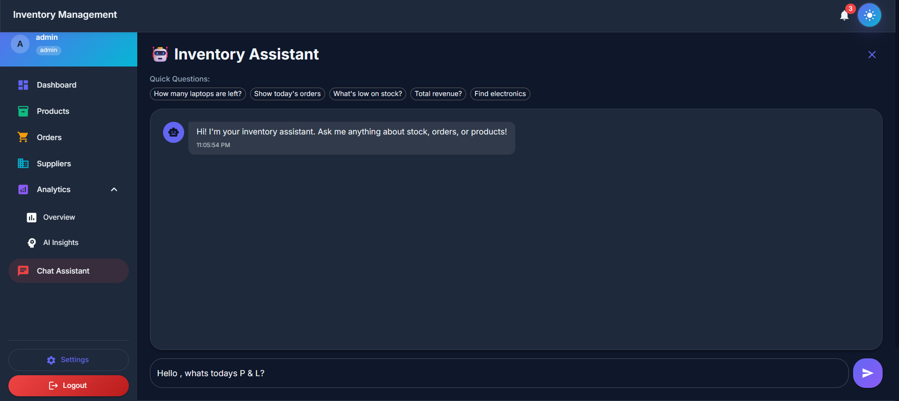

# 📦 Inventory Management Pro

A full-stack inventory management system I built with AI features baked in — from smart product search to a floating AI shopping assistant. It's designed to feel like a real business tool, not just a CRUD app.



---

## 🚀 What This Project Is About

I wanted to build something that goes beyond basic inventory tracking. So I added AI-powered insights, a chatbot assistant, smart semantic search, and a customer-facing shop — all in one system. The admin manages everything from the dashboard, while customers get a smooth shopping experience with an AI helper floating on the side.

---

## ✨ Features

### 🏠 Dashboard
- Live stats — total products, orders, low stock alerts, and revenue at a glance
- Peak hours bar chart showing when orders come in most
- AI recommendations panel with scored product suggestions
- Animated stat cards with trend indicators (up/down)


---

### 📦 Products & Orders Management
- Full CRUD — add, edit, delete products
- Category-based organization with low stock threshold warnings
- View and manage all customer orders with status tracking



---

### 🏭 Suppliers & Analytics
- Manage supplier profiles with ratings and delivery time
- AI-generated supplier recommendations based on performance data
- Visual breakdown of inventory and sales with bar, line, and pie charts



---

### 🤖 AI Insights
- Inventory health recommendations based on real data
- Customer behavior analysis — peak hours, repeat buyers, retention rate
- Supplier improvement suggestions
- Revenue tips calculated from actual order history



---

### 🛍️ Customer Shop + AI Floating Assistant
- Customer-facing product browsing with add to cart
- Smart semantic search — type "tech" and get electronics, type a number and get products in that price range
- Floating AI assistant fixed at bottom-right with trending products, quick actions, and product recommendations embedded in chat replies



---

### 🔐 Auth & Theme
- JWT-based authentication with role-based access (admin vs customer)
- Protected routes — unauthenticated users get redirected
- Full dark / light mode toggle persisted across pages

---

## 🗂️ Project Structure

```
inventory-management-pro/
├── backend/
│   ├── middleware/        # JWT auth middleware
│   ├── models/            # Mongoose models (Product, Order, User, Cart, Supplier, ChatHistory)
│   ├── routes/            # Express route handlers
│   ├── services/          # AI, Gemini, Chatbot, SmartSearch services
│   └── server.js
├── frontend/
│   ├── src/
│   │   ├── components/    # Layout, ThemeToggle, AIFloatingHelper, SmartSearchBox
│   │   ├── contexts/      # AuthContext, ThemeContext
│   │   ├── pages/         # Dashboard, Products, Orders, Suppliers, Analytics, Shop, Chatbot
│   │   └── services/      # Axios API service
│   └── public/
├── images/                # Project screenshots
└── README.md
```

---

## 🛠️ Tech Stack

### Frontend
| Tech | Purpose |
|------|---------|
| React 18 | UI framework |
| Material UI v5 | Component library |
| Recharts | Charts and data visualization |
| Framer Motion | Animations |
| React Router v6 | Client-side routing |
| Axios | HTTP requests |
| React Hot Toast | Notifications |

### Backend
| Tech | Purpose |
|------|---------|
| Node.js + Express | REST API server |
| MongoDB + Mongoose | Database |
| JWT | Authentication |
| bcryptjs | Password hashing |
| ml-regression | ML-based product scoring |
| dotenv | Environment config |

---

## ⚙️ Getting Started

### Prerequisites
- Node.js v18+
- MongoDB (local or Atlas)
- npm

### 1. Clone the repo
```bash
git clone https://github.com/<your-username>/inventory-management-pro.git
cd inventory-management-pro
```

### 2. Setup Backend
```bash
cd backend
npm install
```

Create a `.env` file in the `backend/` folder:
```env
MONGODB_URI=<your_mongodb_connection_string>
JWT_SECRET=<your_jwt_secret>
GEMINI_API_KEY=<your_gemini_api_key>
PORT=5000
```

Start the backend:
```bash
npm run dev
```

### 3. Setup Frontend
```bash
cd frontend
npm install
npm start
```

Frontend runs on `http://localhost:3000`, backend on `http://localhost:5000`.

---

## 🔌 API Endpoints

| Method | Endpoint | Description |
|--------|----------|-------------|
| POST | `/api/auth/login` | Login |
| POST | `/api/auth/register` | Register |
| GET | `/api/products` | Get all products |
| POST | `/api/products` | Add product |
| PUT | `/api/products/:id` | Update product |
| DELETE | `/api/products/:id` | Delete product |
| GET | `/api/orders` | Get all orders |
| GET | `/api/suppliers` | Get all suppliers |
| GET | `/api/analytics/dashboard` | Dashboard stats |
| GET | `/api/ai/recommendations` | AI product recommendations |
| GET | `/api/ai/analytics` | Behavior analytics |
| POST | `/api/chatbot/message` | Send chatbot message |
| GET | `/api/customer/products` | Customer product listing |

---

## 💡 Things I Learned Building This

- How to structure a full-stack app cleanly with separate concerns
- Building semantic search without a dedicated search engine
- Making AI feel useful in a real app context, not just a gimmick
- Fixing CSS animation conflicts — `transform` in keyframes vs hover states fight each other
- JWT auth flow end-to-end with protected routes on both frontend and backend

---

## 📄 License

MIT — feel free to use, fork, or build on top of this.

---

> Built with a focus on making it feel production-ready. Every feature was intentionally chosen to solve a real problem.
